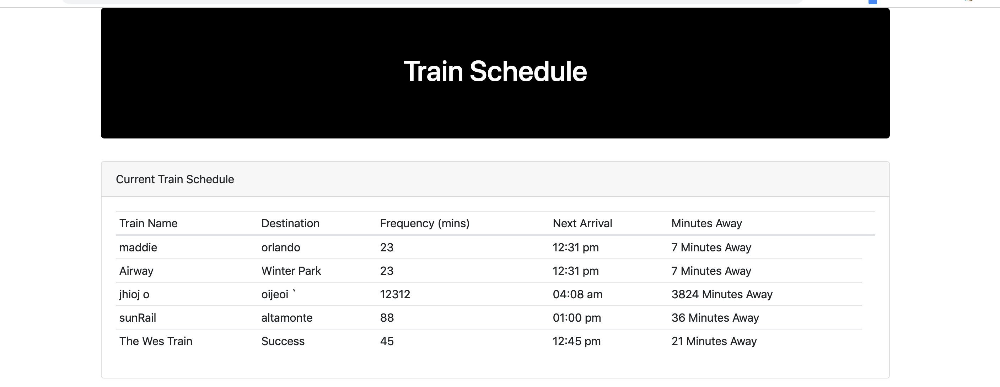
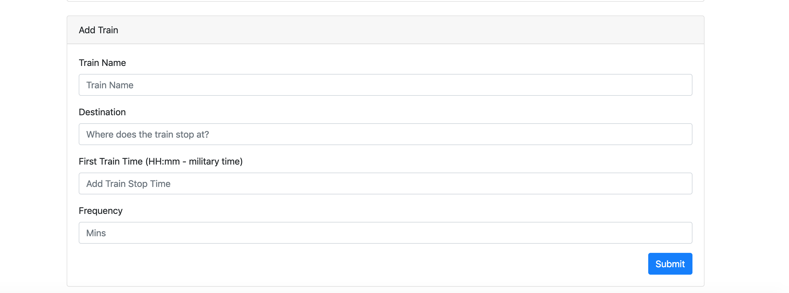

# Firebase-Train-Schedule-Assignment
Firebase homework

# TrainTime-Firebase

Created during Week 4 of UCF Coding Bootcamp. Firebase Application to accept input from user to create a fictional train list and calculate the next train and minutes away.

## Getting Started 
https://pmaddie.github.io/Firebase-Train-Schedule-Assignment/

## Screen Shot

List of trains saved to the Firebase Database.


Form to create new trains to add to the database.

## Technologies used
- JS
- jQuery
- Firebase

### Prerequisites

```
- Bootstrap https://getbootstrap.com/ for the CDN and link in html
- jQuery: visit http://code.jquery.com/ and link in html
- Firebase: https://firebase.google.com/
```

## Built With

* VS CODE

## Authors

* **Madeline Prusak** - *HTML/CSS/JS* - [Madeline Prusak](https://github.com/pmaddie)